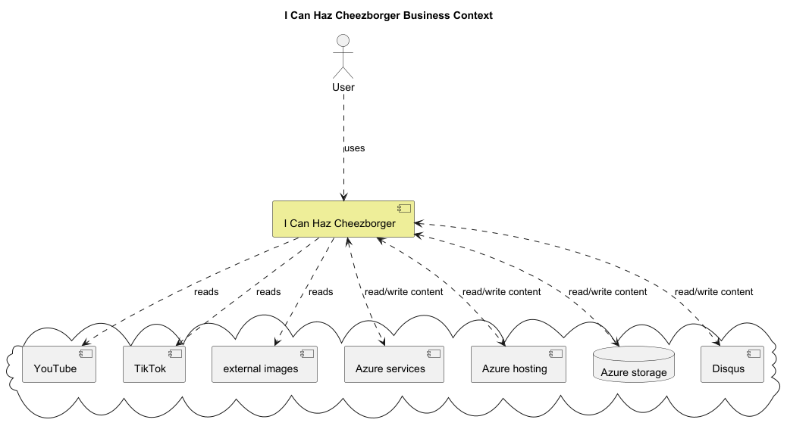
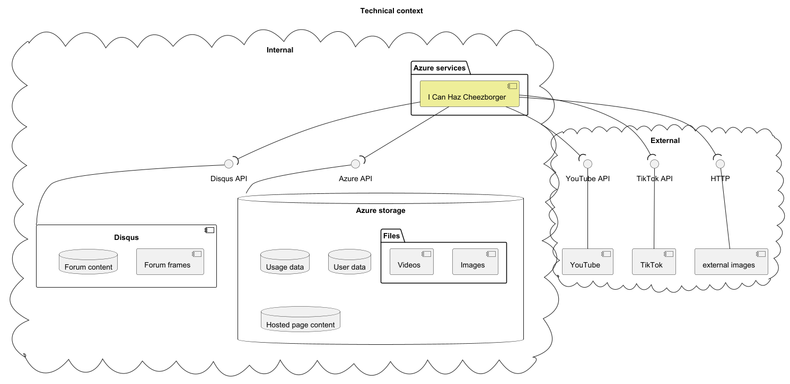

# 1. Introduction & Goals

## 1.1 Requirements Overview

My solution to the [I Can Haz Cheezborger kata](https://fundamentalsofsoftwarearchitecture.com/katas/kata?id=Cheezborger).

## 1.2 Quality Goals

| Quality Attribute | Description |
|---|---|
| Accessibility | All content must be accessible to users with disabilities, or where not possible, eg. visual content for visually impaired users, alternative access to the content must be provided, eg. alt tags |
| Interoperability | The social media landscape will undergo several unanticipated changes over the next 10 years. The software must be able to interoperate with these new and rapidly changing external systems. |
| Evolvability | Internet trends change quickly, the system must support adding new functionality quickly to match |
| Observability | VC funder wants to harvest data across trends |

## 1.3 Stakeholders

| Role/Name | Contact | Expectations |
|---|---|---|
| Product Owner | ? | Define product road map |
| Architect / Bob | bob@cheezborger.com | Determine and document desired architecture |
| Technical Lead | ? | Coordinate implementation of system according to documented architecture |
| Development Team | ? | Implement system according to documented architecture |
| Quality | ? | Verify quality of the system against documented architecture |

# 2. Constraints

| Constraint | Description |
|---|---|
| International privacy law | The system is intended for use in most countries in the world and must adhere to the data privacy laws of each one. |
| Small development team | To stretch existing VC funding, we will start with a small development team to prove value to secure future funding. |

# 3. Context & Scope

## 3.1 Business context

## 3.2 Technical Context

# 4. Solution Strategy

See requirements

| Quality Goal | Scenario | Solution approach | Link to details |
|---|---|---|---|
| 10.2.2 SC6 | Time to market | **Design to discard**. The system will be designed in such a way that subsystems can be swapped out easily, thus allowing the components to be written quickly and replaced with more maintainable and more scalable code over time as needed | |
| 10.2.2 SC6 | Time to market | **Leverage 3rd party solutions**. We will use Azure hosting for web pages, data, and services. We will use Disqus for the forums. |
| 10.2.2 SC4 | Interoperability | **Loose message structure**. Subsystems will not communicate through strict message structures |

# Building Block View
# Runtime View
# Deployment View
# Crosscutting Concepts
# Architectural Decisions

# 10. Quality Requirements

## 10.1 Quality Tree

| Quality Category | Quality | Description | Scenario |
|---|---|---|---|
| Usability | Efficiency of Use | User should be able to use the software to turn their idea into finished product quickly with limited interaction | SC1 |
| Learnability | Ease of Learning | The functionality to create page, create a mash-up, and flag content should be discoverable and intuitive | |
| Scalability | Support Increasing User Base | The system should support an increasing user base up to millions of readers, thousands of posters, and dozens of admins | SC2 |
| Legal | Data Privacy Laws | Storage location and duration, as well as usage, must comply to all markets in which we will operate | |
| | Legal Content | Content injected into system must be scanned for copyrighted content | |
| Accessibility | Accessible to different levels of visual impairment | All content must be accessible to users with visual impairment, or where not possible, alternative access to the content must be provided, eg. alt tags | |
| Discoverablility | Optimized for Search Engines | Output must be designed to optimize SEO | |
| Interoperability | Ability to search and consume content from other products | The social media landscape will undergo several unanticipated changes over the next 10 years. The software must be able to interoperate with these new and rapidly changing external systems. | SC3 |
| | Quickly integrate new systems | As new systems arise that contain memes, the system must be able to integrate with them quickly. | SC4 |
| Evolvability | Quickly adopt new types of content | Internet trends change quickly, the system must support adding new functionality quickly to match | SC5 |
| Maintainability | Support for 10 years | As this product is intended to grow into a position of dominance over 10 years, the system must be easy to maintain | |
| Time to Market | Be online by end of fiscal year | To secure future funding, we must be serving our first pages and marketing data by end of the fiscal year | SC6 |
| Scalability | Increasing storage needs | Storage needs can grow indefinitely as content is added | |
| Responsiveness | Hot content served quickly | The hottest meme pages and their content must be available quickly | |
| Elasticity | Handle surges during meme-worth events | When a meme is hot, traffic will spike for its page, and we must be able to serve spikes in views and edits | |
| Observability | Collect usage data | VC funder wants to harvest data across trends | |

## 10.2 Quality Scenarios

| Id | Scenario |
|---|---|
| SC1 | A user should be able to create a new meme page in 3 clicks if they have the URL of the source content |
| SC2 | The system UI should be designed such that it will make sense and be intuitive even with a million registered users |
| SC3 | The systems must be able to seamlessly consume content from the following services: YouTube, TikTok |
| SC4 | The system will make no assumptions about the source of its content |
| SC5 | Parts of the system not responsible for display nor storage will treat all types of content generically |
| SC6 | The system will be built to enable easy replacement of internal components |

# Risks & Technical Debt
# Glossary